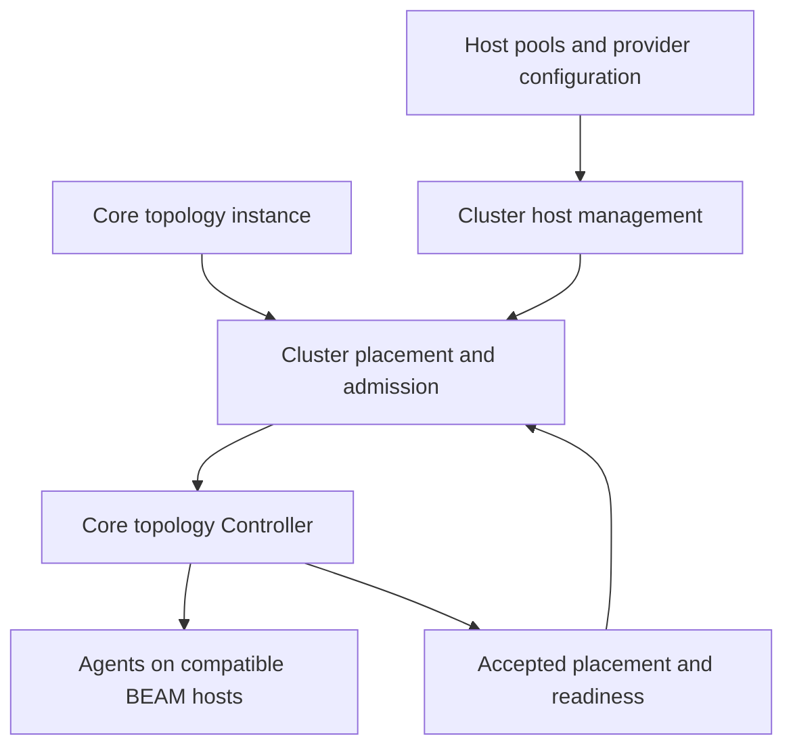

# Architectural vision

Status: architectural direction agreed in discussion on 2026-09-15. Exact APIs
and protocols remain proposed. This defines direction, not current guarantees.
The [delivery slices](delivery-plan.md) define the current order
and take precedence over delivery sequences in earlier proposals.

## Review refinements

The [shared lifecycle contracts](lifecycle-contracts.md) refine the agreed design:
confirmed cleanup before coordinator recovery; host budget ownership; independent
progress around uncertain resources; bounded journal retention; separate readiness
observations; explicit federation ingress bounds; one host boot protocol; and an
early entity mapping probe. These requirements take precedence over less precise
wording in earlier proposals. Their evidence remains pending.

## Preparing to build

Use [build readiness](build-readiness.md) for the first implementation gate and
[the Hyper review](../90_reference/04_hyper/README.md) for the source-backed lessons.
Candidate observations inform planning; confirmed claims authorize activation.
Resource reconciliation remains necessary after abrupt process death.

## Public description

**Jido Cluster deploys core Jido topologies across managed compute hosts and
coordinates their placement, capacity, recovery, and federated Signal channels.**

Applications define Agents and their structure with core `Jido.Topology`.
Cluster extensions add placement requirements. Runtime configuration supplies
host pools and providers. Cluster selects suitable hosts, accounts for capacity, tracks
accepted placement, and coordinates startup, movement, drain, and recovery
through Jido core. Callers retain stable Agent identity as processes change.

Use core Jido to define and run Agents. Add Cluster when placement must be managed
across nodes. Higher-level systems can use these contracts to build long-lived
domain entities with their own durability and recovery policies.

## Named OTP instances

The public entry point follows core's instance pattern. `use Jido.Cluster`
defines a named OTP instance with `child_spec/1`, `start_link/1`, and configuration
loading. The following is proposed syntax, not implemented code:

```elixir
defmodule MyApp.Jido.Cluster do
  use Jido.Cluster,
    otp_app: :my_app,
    namespace: "my-app/workers"
end

# The application starts its configured Bedrock repository first.
children = [MyApp.BedrockRepo, MyApp.Jido.Cluster]

config :my_app, MyApp.Jido.Cluster,
  journal: {Jido.Persistence.Bedrock, repo: MyApp.BedrockRepo},
  pools: [workers: [provider: {Jido.Cluster.Provider.Static, hosts: worker_hosts}]]
```

When `jido:` is omitted, Cluster starts and owns an underlying core Jido instance.
Its stable name is derived from the Cluster module; it does not imply that a
separate `MyApp.Jido` module exists. Core starts before the dependent Cluster
services and outlives their cleanup. Core failure requires dependent services to
stop and reconcile before accepting mutations again. Use a rest-for-one-style
ownership boundary, subject to the detailed shutdown and cleanup protocol.

An explicit `jido: MyApp.Jido` attaches to an application-owned core instance:

```elixir
defmodule MyApp.Jido.Cluster do
  use Jido.Cluster, otp_app: :my_app, jido: MyApp.Jido
end

children = [MyApp.Jido, MyApp.Jido.Cluster]
```

Attached mode never starts, stops, or changes the external instance's persistence.
It validates the instance and exact namespace before deployment. Omitted namespace
uses the attached instance's namespace; a conflicting explicit namespace fails.
The application must preserve the startup and shutdown dependency, for example
with a rest-for-one boundary. Loss of the attached instance blocks new work and
requires reconciliation. Mode is explicit: an existing instance with a colliding
name is an error, not a reason to silently attach.

Configuration combines module defaults, application configuration under the
Cluster module, and child-start overrides, in that order. The resulting instance
identity, underlying Jido name, namespace, and capacity scope must be inspectable.
A local service name cannot create a second owner for the same logical scope.
Each participating host still needs a compatible core runtime; starting the
control instance does not start remote hosts automatically.

## Journal through core persistence

The default journal adapter is `Jido.Persistence.Bedrock`. Cluster uses the normal
`Jido.Persistence.Adapter` byte-storage and conditional-write contract, rather
than defining another backend adapter family. The application supplies the
Bedrock dependency, repository, and configuration. A default adapter does not
mean a default database can be started without configuration. Missing dependencies
or repository settings must fail validation; there is no silent memory fallback.

Allow an explicit journal adapter override using the normal `{adapter, options}`
form, including core Ecto persistence when its guarantees meet the journal's
requirements. Agent persistence and journal persistence are separately configured;
attaching to Jido does not implicitly select or mutate its Agent persistence.
They can use the same repository with separate keys.

Cluster owns journal record encoding, schema versions, scope keys, request
bindings, operation transitions, and recovery. It must not encode operation
records as Agent checkpoints. Core provides storage mechanisms, not the journal
state machine. Per-key CAS does not establish multi-key transactions, enumeration,
or writer fencing. Detailed journal design must specify how an index or aggregate
record supports recovery through this minimal contract, including bounded growth
and retention. Preserve indeterminate write results as uncertainty.

Memory-only storage is an explicit test or development choice and must expose its
restart limitations. Bedrock remains optional for consumers that choose another
supported adapter. Test both missing-dependency errors and alternative adapters.

## A core topology is the workload contract

The main deployment input is a core `Jido.Topology.Instance`, with its validated
input and core plan. Cluster does not define a competing Agent graph, derive a
second set of Agent IDs, or replace core dependency and readiness rules.

Keep three concepts explicit:

| Concept | Defines | Owner |
| --- | --- | --- |
| Workload topology | Agents, relationships, resources, stable IDs, and startup dependencies | Core Jido |
| Host pool | Existing or acquired runtime hosts, capabilities, and capacity | Jido Cluster |
| Deployment | Placement and lifecycle of one topology instance on that pool | Jido Cluster using core |

A host pool can serve several topology instances. A topology can span several
hosts. A topology definition does not create a separate Erlang cluster or own an
entire machine by default. Use “host inventory” for infrastructure membership so
it is not confused with the core workload topology.

Use the core extension mechanism to record portable placement requirements.
The existing `cluster_worker` form is the first example. Extension lowering must
not contact providers or start processes. Keep credentials, images, provider
options, and host ownership in runtime configuration. A second placement DSL is
not required to establish this architecture.

Cluster validates the supported shape before any acquisition or activation.
Current support is root singleton Agents. Groups, includes, Plugin-added Agents,
and local resource bindings need explicit support and tests. A remote host cannot
make a core local Bus binding valid. Core owns topology expansion; Cluster must
use a public validated placement seam for expanded plans when it is available.



## Host lifecycle is part of Cluster

Cluster owns the relationship between a deployment and its compute resources.
Optional provider adapters acquire, inspect, and release those resources. Static
hosts, Sprites, Fly Machines, and Kubernetes workloads are candidate integrations;
this document does not claim implemented support for them.

A host record identifies the provider resource, its incarnation, its BEAM node,
runtime compatibility, ownership, and capacity claims. Provider readiness and
core Agent readiness are separate checks. A resource used only for tool execution
or files is not automatically a topology host.

- Borrowed capacity remains application-owned; release removes Cluster claims.
- Acquired capacity can be released by Cluster only when its ownership contract
  permits it and all required Agent cleanup and claims have settled.
- A Kubernetes adapter must name its managed unit: workload, pod, or node capacity.
  Placing an Agent does not imply ownership of the underlying Kubernetes node.

The deployment sequence is: validate the topology and requirements, plan capacity,
record the operation, reserve or acquire capacity, verify compatible connected
runtimes, activate through core, and report readiness. Planning reserves nothing.
Admission includes configured acquisition limits; it does not pretend an uncreated
host is ready. Failed steps retain partial progress and uncertain cleanup.

During stop or drain, settle Agent retirement before releasing owned resources.
Keep shared hosts while other deployments use them. Record acquisition request
identity before side effects so timeout recovery can inspect an existing request
instead of creating another machine.

LitterBox is a possible implementation source behind the provider boundary. Its
current lifecycle must be reviewed before selecting a dependency or code reuse.
Cluster's public contract remains host lifecycle for topology placement. It does
not require exposing a general sandbox, file, or terminal API.

## Capability boundaries and package direction

Packaging revision: prefer fewer packages. The Fabric experiment is a source of
capabilities that can move into `jido_cluster`; it does not require a separate
public package. The boundaries below are conceptual responsibilities and can be
implemented as modules within Cluster. Consolidation is proposed, not completed.

| Layer | Question it answers | Contract |
| --- | --- | --- |
| Jido core | How does this Agent run? | Identity, state transitions, execution, supervision, checkpoints, topology activation, readiness, and exact-node movement |
| Jido Cluster | Where does this topology run, and who owns its capacity? | Host lifecycle, admission, placement, observed location, and coordinated lifecycle operations |
| Optional entity capabilities in Cluster, informed by Fabric | How does this domain entity retain continuity under a stated failure model? | Domain identity mapping, entity routing policy, durability and acknowledgement policy, and future replica recovery |

The preferred public structure is core Jido plus Jido Cluster. Cluster must be
useful without entity replication or AI. Entity capabilities use the same placement
and lifecycle mechanisms as topology deployment. Core remains useful without
Cluster. Do not add a dependency on the old Fabric package to obtain these features.

`jido_action` supplies executable Actions. `jido_signal` supplies Signal values,
local Buses, and transport mechanisms. `jido_ai` supplies model and tool behavior.
Core's optional persistence adapters supply Agent storage mechanisms. Semantic
memory remains a separate concern. Applications own business workflows, sessions,
tenant policy, and external-effect handling.

## What the Fabric review changes

The [previous focus](../90_reference/03_package-focus/README.md) correctly prioritizes shared
admission and static-host proofs. It is too narrow if read as making Cluster only
a scheduler for a fixed topology. The existing keyed manager is also a legitimate
connected placement mechanism.

The main public deployment model starts with a core topology. A later extension
can also accept keyed demand:

- A declared topology: a finite set of Agent requirements admitted together.
- Keyed activation: demand within an explicitly defined workload scope, with
  its mapping to core topology and Agent identity specified before promotion.

Both must eventually obey the same capacity, ownership, and drain rules when they
share a pool. They must not run competing placement loops for one identity. The
first V3 release can support topology placement while keeping the current keyed
manager separately scoped. Do not claim unified budgets until a mixed-demand test
proves them. Do not create one topology Controller per entity merely to fit the
topology API; choose activation granularity through a separate scale proof.

Shared admission proves useful coordination beyond core. It is one capability
within placement management, not the complete product description.

## Boundary rules that prevent overlap

1. **One runtime.** Core performs Agent execution, checkpoint handling, and
   activation. Cluster uses public core operations.
2. **One placement owner.** Optional entity features may request a policy or
   desired placement. The same Cluster owner admits and coordinates the change;
   no independent entity repair loop moves the same Agent.
3. **One identity mapping.** Core Ref identifies the Agent. Entity features can map a
   domain key to that Ref. That mapping must preserve existing persisted IDs
   during migration.
4. **Policy and observation are different.** A hash result is a candidate;
   accepted placement and ready location are observed runtime facts. Routing
   must account for transitions and stale views.
5. **Placement ownership is not write authority.** Connected exclusion prevents
   competing coordinators in its supported scope. Exclusive replacement after
   partition requires an authority protocol and an atomic enforcement point.
6. **Success has a named meaning.** Core commit, placement readiness, provider
   readiness, and replicated durability are different acknowledgements. No layer
   silently strengthens the guarantee of the layer below it.

Optional entity features can define replica count, failure-domain requirements, and acknowledgement
policy. Generic host labels and placement constraints can belong in Cluster once
proved. Replica synchronization, read consistency, and recovery from replica state
remain a distinct internal protocol. Storage must enforce any claimed stale-writer
rejection; a configuration option alone cannot provide it.

## Waterpark inspiration

Bryan Hunter's official Strange Loop abstract describes long-lived digital twins,
process pairs, rendezvous hashing, location transparency, and operation across data
centers. Those ideas motivate stable identity and continuity across process changes.
See [Waterpark: Distributed Actors vs the Pandemic](https://www.thestrangeloop.com/2021/waterpark-distributed-actors-vs-the-pandemic.html).

Our architectural interpretation is to separate the reusable connected placement
mechanisms from the stronger entity-continuity protocol. The abstract does not
provide a complete replication or fencing specification. Its availability claims
are not evidence for Jido guarantees.

Deterministic candidate selection can reduce lookup work. It does not establish
agreement during membership changes or authorize a new writer. Likewise, a shared
admission coordinator need not handle every Agent message. Keep capacity decisions
off the normal message path where the proved routing contract permits it. The
first connected coordinator remains an explicit control-plane availability limit.

## External developer guide

| Need | Starting point |
| --- | --- |
| Run an Agent or topology in one application | Jido core |
| Use explicit remote nodes with application-owned placement policy | Core topology Controller |
| Select hosts, share capacity, or drain managed Agents across nodes | Jido Cluster |
| Add LLM or tool behavior | Jido AI with core, optionally Cluster |
| Build an account, device, or patient actor with stronger continuity policy | Optional Cluster entity capabilities after their contracts are proved |
| Acquire a container or hosted BEAM node | A later Cluster provider integration |
| Execute a tool in an external sandbox | An application/tool integration; that sandbox need not be a Jido host |

A useful public example is a device-processing service. Two topology instances
share a worker pool. Cluster admits them, moves their workers during drain, and
retains uncertain claims after an interrupted move. Core preserves Agent state
through the configured persistence contract. A later Fabric example adds domain
device keys and a specific durability policy. The Cluster example must stand on
its own without that higher layer.

## Federated Signal channels

Federation is part of the package scope. Core topology extensions declare scoped
channels and subscriptions to managed Agent Refs. Each participating host retains
local Signal Buses. Cluster owns channel bridges, host interest, and subscription
bindings as placement changes. Core local Bus rules remain unchanged.

Required subscription attachment is a deployment-readiness condition after core
Agent readiness. Movement must settle source cleanup, establish target readiness,
and attach the binding on the target. A failed bridge reports federation health
separately from host and Agent health; event loss does not authorize replacement.

The first mode is opt-in best-effort forwarding with bounded queues, scope
isolation, original Signal preservation, loop prevention, and bounded duplicate
suppression. Publication acknowledges local acceptance and outbound submission,
not remote execution or durable delivery. Movement and restart can lose events.
Durable delivery requires a separate replay and acknowledgement protocol.

See the [federation protocol proposal](../90_reference/02_top-level-api/signal-federation.md)
for candidate details. Its exact API and transport remain subject to slice design.

## Delivery focus

### Optional integrations in one package

Follow the pattern in core's `mix.exs` and `Jido.Persistence.Ecto` and
`Jido.Persistence.Bedrock`: optional backend dependencies, explicit configuration,
and clear validation errors when a selected dependency is unavailable. Ecto's
implementation is conditional on its modules being present at compile time.
Bedrock validates dependency availability and supported versions. Applications
own their repositories and database setup.

Reuse core persistence for Agent checkpoints. Do not copy those adapters into
Cluster or require a separate Jido storage package for the same function. Cluster
operation records need their own schema, keys, and lifecycle. They may use the
same backend where its contract is sufficient, but Agent checkpoint CAS does not
by itself implement a journal transaction or writer fencing.

Keep entity identity and policy code free of mandatory storage backends. Enable
stronger durability or authority only through a configured, tested implementation.
An installed dependency does not enable a feature automatically. Reject missing
capabilities explicitly; never silently fall back to weaker guarantees.

Test the base package without optional dependencies, each enabled integration,
and invalid configuration. Do not assume the package's normal development suite
proves compilation without optional libraries. For a compile-time integration,
document that adding its dependency requires recompilation.

Move useful Fabric code in tested slices: identity mapping, candidate selection,
then any proved continuity protocol. Consolidate duplicate routing and placement
paths during migration. Preserve existing identities and persisted data. A package
merge does not promote experimental replica or acknowledgement guarantees.

### Proof sequence

Retain the five static-host proof gates from
[Package focus](../90_reference/03_package-focus/README.md): competing admission, shared-host
cleanup, scope-wide drain, interrupted-drain restart, and uncertain host loss.

After the federation slices defined in the delivery plan, prove one acquired-host provider: deploy a core topology, acquire compatible
capacity, survive an acquisition timeout without duplicate creation, and release
the resource only after confirmed cleanup. The journal and static lifecycle proofs
are prerequisites. Additional providers run the same contract suite.

Then prove the entity boundary with one small V3 integration: a domain identity
maps to a stable core identity, uses an admitted placement, survives a cooperative
move, and returns explicit uncertainty when the source cannot be retired. This
proves composition; it does not prove replica durability or region failover.

Only then add further acquisition providers or unify keyed demand with topology
admission. Federation is a required capability, delivered before acquired-host providers.
Load-driven movement remains deferred. Public
docs must label each guarantee as implemented, proposed, or unsupported.

## Source review and compatibility

The local Fabric package was found at
`/Users/mhostetler/Source/Jido/proj_bedrock_cluster/jido_fabric` on `main`.
The review read its README, Mix configuration, facade, Router, and Placement.

- Primary `route` and `cast` delegate to `Jido.Cluster.InstanceManager`.
- `place` computes a candidate primary and followers from a supplied view. Its
  output does not drive Router's manager call.
- Follower query returns an explicit unsupported error.
- Placement records region metadata but the inspected selection does not enforce
  separation across regions or availability zones.
- The Mix fallback selects Jido `~> 2.2`; README configuration includes older
  replication and handoff options. It is not evidence of V3 compatibility.

The older workspace also contains Waterpark research and a private Fabric scope
plan. Their references to Pods, live replicas, leases, and older storage APIs are
historical design inputs, not current V3 contracts. No Fabric code or dependencies
were changed or tested for this documentation review.

Before a V3 integration, specify the key-to-Ref mapping, select one placement
decision path, and prove authority and acknowledgement behavior separately. Keep
Fabric private while those protocols remain experimental. Public Cluster docs
must remain complete without requiring access to the private repository.
