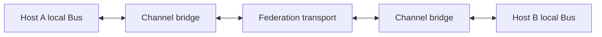

# Signal federation

Status: proposed on 2026-09-15. This optional feature extends the
[top-level API design](design.md). No federation API or distributed Bus contract
is implemented by this documentation change.

## Purpose and ownership

Federation lets Agents exchange selected events across hosts while subscriptions
follow stable Agent identity. Each host retains a local Jido Signal Bus. Cluster
placement manages the bridges, host interest, and Agent-location bindings.



| Owner | Contract |
| --- | --- |
| `jido_signal` | Local Bus semantics, Signal envelope, serialization, and generic dispatch adapters |
| `jido_cluster` | Channel scope, bridge supervision, host interest, Ref subscription bindings, movement integration, and federation status |
| Transport | Cross-host transmission with explicit delivery and connection behavior |
| Application | Event meaning, business acknowledgements, retries, and duplicate-effect handling |

Start with best-effort progress and lifecycle events. Direct work addressed to one
Agent continues to use the cluster Ref call API. Federation does not create a
durable queue, a workflow engine, or exactly-once business effects.

## Channels and authoring

A channel is scoped by exact namespace, topology ID, and channel key. Each hosting
node has a local mirror. Channel names alone cannot merge tenants or deployments.
Sharing a channel across deployments requires a separate explicit scope contract.

Proposed extension syntax:

```elixir
topology do
  agents do
    agent :coder, MyApp.Coder
    agent :reviewer, MyApp.Reviewer
  end

  federation do
    channel :team_events, allow: ["team.progress.**", "team.review.**"]
    listen :reviewer, to: :team_events, path: "team.progress.**"
  end
end
```

This requires the cluster topology extension. It lowers to portable channel and
subscription metadata. It does not turn these bindings into ordinary core local
Bus connections. Core's existing remote-Agent/local-Bus rejection remains intact.

The prepared host runtime supplies local mirror Buses and supervised bridges.
After core activation, the cluster owner resolves each listening Agent's Ref and
attaches its local PID to the Bus on that host. A required declared binding is a
deployment-readiness step; local attachment is not proof of remote consumption.

Transport settings remain runtime configuration. Phoenix.PubSub is an optional
first candidate for connected BEAM hosts. The existing PubSub dispatch adapter is
useful machinery, but it does not implement channel mirroring, movement, replay,
or the federation protocol.

## Proposed API

All calls below are new proposals. Subscriptions target managed Agent Refs rather
than caller PIDs that become stale after movement.

| Call | Result and meaning |
| --- | --- |
| `publish(cluster, topology_id, channel, signal)` | `{:ok, PublicationReceipt}` after local mirror append and bounded outbound submission, or `{:error, Error}`. No acknowledgement of remote delivery or Agent commit. |
| `subscribe(cluster, topology_id, channel, path, opts)` | `{:ok, subscription_id}` after attaching the managed Ref in `opts[:target]` on its ready host, or `{:error, Error}`. The binding follows that Ref during cooperative movement. |
| `unsubscribe(cluster, subscription_id)` | `:ok` after confirmed detachment, or `{:error, Error}`. Retain uncertain cleanup in status. |
| `federation_status(cluster, topology_id)` | `{:ok, FederationStatus}` with channels, host interest, binding revisions, bridge state, queue usage, and drops, or `{:error, Error}`. |

Validate scope, allowed Signal types, payload bounds, and queue capacity before
local append. If local Bus append fails, do not transmit that publication. If
transport fails after submission, report the failure through federation status;
do not imply that already observed local delivery was rolled back.

`PublicationReceipt` identifies the export, mode, and local cursor. It is not a
placement operation or a deduplication receipt for application work. A publish
timeout can have an unknown submission result; do not replay it automatically.

Subscription definitions come from topology metadata or explicit runtime calls.
Runtime subscription IDs bind scope, path, and Ref. Repeating the same supplied
ID and binding may reattach; changing that binding with the same ID conflicts.
Journal-backed persistence of runtime bindings is a later gate. The first slice
must state when bridge or coordinator restart requires reattachment.

## Forwarding and loop prevention

Keep the original Signal ID, source, type, trace, and payload. Use existing Signal
serialization. Carry federation scope, protocol version, origin host and bridge
generation, export ID, and bounded hop information in a transport envelope.
Unwrap before local delivery so application Agents receive the original Signal.

With the existing Signal-only dispatch interface, a transport can carry a wrapper
Signal containing the encoded original and federation metadata. That wrapper is
transport data; it must never be published as the application event on the mirror.

The first slice exports only explicit federation publications. Imported local Bus
delivery does not automatically trigger another export. A later local-Bus export
subscription needs origin tracking and loop tests before it is supported.

Maintain host interest by channel and path. Send one export per interested host,
then let that host's Bus perform local delivery. Do not send one network copy per
local Agent. Remove host interest only after its last applicable binding detaches.

Use a bounded duplicate cache keyed by origin generation and export identity.
It suppresses repeated transport exports only while retained. It does not promise
deduplication after cache expiry or restart, or merge separate publications of
the same application Signal. Reject scope mismatches and exhausted hop bounds.

## Delivery, limits, and failure

| Concern | First federation contract |
| --- | --- |
| Delivery | Best effort; submission does not acknowledge a remote Bus or Agent |
| Ordering | Local Bus append/delivery order remains local; no cross-host or global ordering promise |
| Buffering | Bounded bridge queues and payloads; reject before local append when the outbound queue is full |
| Disconnect | Expose degraded links and dropped or unsent exports; no automatic business replay |
| Restart | Memory-only mirror records and caches may be lost; reconstruct declared bindings from topology metadata |
| Duplicates | Bounded transport suppression; application duplicate-effect handling remains separate |
| Authority | Receiving an event does not grant placement ownership or permission to write |

Bridge queue limits do not bound Agent mailboxes. Consumer demand and slow-Agent
policy need separate application or runtime contracts.

The current Bus includes only a memory Store. A durable federation mode requires
proved persistent source and destination records, acknowledgement boundaries,
replay cursors, retention limits, destination deduplication, and subscription
restart behavior. Calling a local subscription durable does not establish that
cross-host protocol.

Default Erlang distribution and a PubSub transport still have node-connection
costs. Federation does not by itself remove the connected runtime's mesh or
`:global` assumptions. Connecting separate cluster groups through another
transport requires a separate membership, scope, and delivery proof.

## Placement integration

Keep binding identity separate from location. Record the core Ref, channel, path,
subscription ID, and location revision. Reject attachment requests for superseded
locations or retired host incarnations.

During a cooperative move:

1. Record the binding transition with the placement operation.
2. Retire the old Agent and establish its subscription cleanup.
3. Activate and restore the target through core; wait for readiness.
4. Attach the same logical binding to the target's local Bus.
5. Publish the new binding/location revision and settle required move steps.

The best-effort mode can lose events during the gap. It must not promise continuous
delivery across movement. An uncertain detach or attach remains visible and must
not be reported as a settled required binding.

On topology stop, remove only its bindings, mirrors, and unused bridge resources.
Do not stop a shared host or transport used by another deployment. Transport loss
reports federation degradation; it does not prove that the host or Agent stopped.

Host intelligence may emit federation notifications. Placement decisions still
read the validated host report and admission claims directly. See
[Host intelligence](host-intelligence.md).

## Test and example gates

| Proof | Required observation |
| --- | --- |
| Static authoring | Channel metadata is portable; lowering starts no Bus or transport |
| Scope | Same channel key in two deployments cannot leak Signals across scope |
| Original envelope | ID, source, type, payload, and trace survive transport wrapping and local delivery |
| Interest routing | Subscribed hosts receive the event; uninterested hosts receive no local delivery |
| Loop prevention | Bidirectional bridges do not re-export imported events indefinitely |
| Duplicate bounds | Repeated exports are suppressed within the documented cache window |
| Capacity | Full outbound queue rejects before local append; slow consumers remain separately observable |
| Movement | A stable Ref binding attaches to the new host; gaps and uncertain steps match the selected delivery mode |
| Restart | Declared bindings reconstruct; lost memory records and runtime bindings are not reported as durable |
| Shared cleanup | Unsubscribing or stopping one deployment retains other bindings and shared transport |
| Disconnect | Link loss is observable without changing host ownership or replaying Agent work |

Proposed living examples under `:example`:

1. **Three-host events:** publish on A, consume on subscribed B, and prove no local
   delivery on uninterested C. Include namespace isolation and loop assertions.
2. **Subscription follows placement:** move a listening Agent, preserve its Ref
   and logical binding, and prove the target receives subsequent events.
3. **Bridge failure:** restart a bridge and interrupt transport; inspect bounded
   queues, documented loss, reconstructed bindings, and cleanup.

## Open decisions

- Exact channel metadata and transport-envelope format.
- Transport adapter, topic identity encoding, and host-interest protocol.
- Runtime binding request IDs, journal retention, and restart behavior.
- Queue bounds, duplicate-cache bounds, and gap reporting.
- Whether durable federation belongs in a separate integration once its source,
  destination, and acknowledgement contracts are proved.
